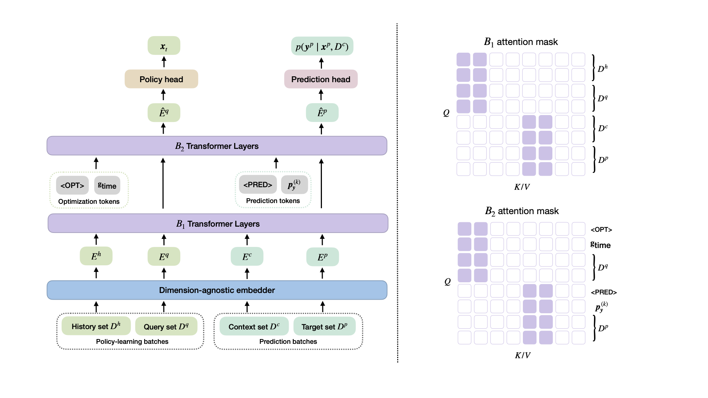

# In-Context Multi-Objective Optimization 

This repository contains the official implementation of the ICLR 2026 paper: [In-Context Multi-Objective Optimization](https://openreview.net/forum?id=odmeUlWta8).



## Installation

1. Clone the repository
2. Create a conda environment (`tamo`) and install dependencies:
   ```
    conda env create --file environment.yml
    conda activate tamo
   ``` 
3. To enable wandb, create `.env` and add your `WANDB_API_KEY` and `WANDB_DATA_DIR` there

## Structure
- `configs/`: Configuration yaml files
- `data/`: Environment and data relevant utilities
- `datasets/`: Generated synthetic dataset
- `model/`: TAMO architecture
- `results/`: Experimental results and model checkpoints
- `utils/`: Util functions
- `test.py`: Testing script
- `train.py`: Training script
- `generate_data.py`: Synthetic data generating script
  
## Examples of usage 
#### Notebooks
Check `notebooks/` for examples of usage and visualizations, where: 
1. `example.ipynb` shows how to create test environment, how TAMO predicts, and util functions to plot TAMO optimization results.
2. `synthetic_data.ipynb` shows how to load generated dataset or online generate synthetic data.

## How to start
### Generate synthetic dataset before training
TAMO is trained on pre-generated synthetic datasets for efficiency. To generate $100000$ dataset containing $300$ datapoints with $d_x=1, d_y=1$ for training:
```bash
python generate_data.py  --config-name=generate_data \
    experiment.mode=train \
    experiment.device=cuda \
    generate.filename="gp_0" \
    generate.x_dim=1 \
    generate.y_dim=1 \
    generate.sampler_type=gp \
    generate.num_datasets=100000 \
    generate.num_datapoints=300 
```
Dataset will be saved at `datasets/train/x_dim_1/y_dim_1/gp_0.hdf5`. Note that dataset can be alternatively saved under `datasets/{data.data_id}/train/x_dim_1/y_dim_1/gp_0.hdf5` by assigning valid values to `data.data_id`. This could be useful if you would like to try different priors.

Check all available arguments in `configs/generate_data.yaml`. 

### Train 
TO train TAMO on dimensions $d_x\in \{1,2\}, d_y \in \{1,2,3\}$: 
```
python train.py --config-name=train \
experiment.expid=[EXPID] \
data.x_dim_list=[1,2] \
data.y_dim_list=[1,2,3] \
train.num_total_epochs=400000 \
train.num_burnin_epochs=393500
```
Check all avaialable arguments in `configs/train.yaml`.

### Evaluation 
To test trained TAMO on GP data with $d_x=2, d_y=2$: 
```
python test.py --config-name=test experiment.expid=[EXPID] data.function_name=dx2_dy2
```
Check all available arguments in `configs/test.yaml`.

#### Test functions
`data/function.py` implements test function classes, where: 
- `SyntheticFunction`: environment based on botorch function.
- `IntepolatorFunction`: environment based on the linear interpolation of dataset. 

These environments enable: 
1. Evaluating the function at certain inputs
2. Sampling from the function
3. Computing hypervolume
4. Computing regrets

Some core functions: 
- `init()`: Sample initial observations.
- `sample()`: Sample from the function.
- `transform_outputs()`: **Transform function values for TAMO**.
- `step()`: update observations, compute hypervolume and regrets on all observations.

#### Results 
Metrics and plots will be saved under `results/data` and `results/plots` respectively.

## Citation 
```
@misc{zhang2025incontextmultiobjectiveoptimization,
      title={In-Context Multi-Objective Optimization}, 
      author={Xinyu Zhang and Conor Hassan and Julien Martinelli and Daolang Huang and Samuel Kaski},
      year={2025},
      eprint={2512.11114},
      archivePrefix={arXiv},
      primaryClass={cs.LG},
      url={https://arxiv.org/abs/2512.11114}, 
}
```